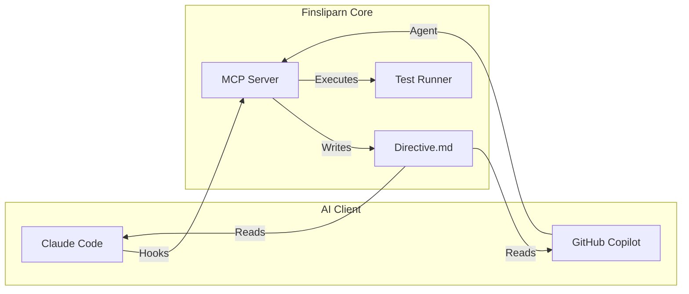

# Finsliparn

> **Swedish**: _the honer_ — from _finslipa_, meaning "to hone", "to fine-tune" or "to put the finishing touches on."

**Finsliparn** is a Bun-native **MCP Server** and **Claude Code Plugin** that transforms single-attempt coding into a multi-attempt, test-validated refinement loop. It adapts the philosophy of [Poetiq's ARC-AGI solver](https://poetiq.ai/posts/arcagi_verified/) to general software development.

---

## 🎯 Core Value Proposition

LLMs often generate code that _looks_ correct but fails in edge cases. Finsliparn solves this by enforcing a **Refinement Loop**:

1. **Iterate**: The LLM implements a solution.
2. **Validate**: Finsliparn runs your actual test suite (not just a syntax check).
3. **Feedback**: Test failures are fed back to the LLM as structured, actionable directives.
4. **Select**: If multiple attempts are made, the best one (highest score, lowest complexity) is selected.

**"Test results are the objective truth—not diffs, not prompts, not opinions."**

---

## 🏗 Architecture

Finsliparn uses a **Filesystem-as-IPC** architecture to support multiple AI platforms with a single core engine.



- **`directive.md`**: The single source of truth. It tells the LLM exactly what to do next (e.g., "Fix failing tests in `src/foo.ts`").
- **Git Worktrees**: Every iteration runs in an isolated worktree, ensuring your main branch stays clean until a solution is verified.

---

## 🚀 Getting Started

### Prerequisites

- [Bun](https://bun.sh) v1.3+
- Git

### Installation (Development)

```bash
# Clone the repository
git clone https://github.com/jgabor/finsliparn.git
cd finsliparn

# Install dependencies
bun install

# Link the plugin (for Claude Code)
# (Coming soon)
```

---

## 📖 Documentation

- **[Technical Specification (v1.0.0)](docs/spec-cc.md)**: The core architecture and Claude Code integration.
- **[Copilot CLI Support (v2.0.0)](docs/spec-copilot.md)**: Adaptation for GitHub Copilot CLI agents.
- **[Roadmap](ROADMAP.md)**: Development plan and status.

---

## 🛠 Usage

### With Claude Code

```bash
# Start a refinement session
/finslipa Implement a fibonacci function in src/math.ts
```

Finsliparn will automatically intercept your edits, run tests, and guide you until the tests pass.

### With GitHub Copilot CLI

```bash
# Start the agent
copilot run --agent finsliparn "Implement a fibonacci function"
```

The agent will autonomously loop through the `directive.md` instructions until completion.

---

## Author

Jonathan Gabor
