# Finsliparn: Technical Specification

- **Version**: 1.0.0 (Claude Code Edition)
- **Status**: Specification
- **Date**: 2025-12-07

---

## About the Name

**Finsliparn** (Swedish: _the honer_) — from _finslipa_, meaning "to hone" or "to fine-tune." The definite form _-arn_ gives it a craftsman quality.

---

## 1. Executive Summary

Finsliparn is a **Bun-native MCP server and Claude Code plugin** that applies iterative refinement and voting-based solution selection to coding tasks, adapting methodology from Poetiq's [ARC-AGI solver](https://poetiq.ai/posts/arcagi_verified/).

**Core value**: Transform single-attempt coding into multi-attempt, test-validated refinement loops.

---

## 2. Design Philosophy

### 2.1 Core Principles

1. **Iterative Refinement**: Solutions improve through structured feedback loops
2. **Test-Driven Validation**: Test results are the objective truth
3. **State Persistence**: Filesystem (`directive.md`) is the single source of truth
4. **Selection over Generation**: Select best of N solutions rather than generate one perfect solution
5. **Non-Destructive Exploration**: Git worktrees enable parallel work without conflicts

---

## 3. Architecture

### 3.1 High-Level Architecture


### 3.2 Directory Structure

```
project/
├── .finsliparn/
│   ├── config.toml
│   ├── directive.md              # Control Plane
│   ├── sessions/{session-id}/
│   │   ├── state.json
│   │   ├── iterations/{N}.json
│   │   └── feedback/{N}.md
│   └── worktrees/
└── [project files]
```

### 3.3 Technology Stack

| Component | Technology |
|-----------|------------|
| Runtime | Bun 1.3+ |
| MCP SDK | `@modelcontextprotocol/sdk` |
| Git | `simple-git` |
| State | JSON files |

---

## 4. Core Components

### 4.1 Session Manager

**RefinementSession** tracks:

- `id`: UUID v4
- `status`: initializing → implementing → iterating → evaluating → completed/failed/cancelled
- `config`: maxIterations (10), targetScore (1.0), testCommand, testTimeout (60s), mergeThreshold (optional)
- `problem`: task description and constraints
- `iterations`: array of iteration results
- `selectedIteration`: winner after voting

**SessionConfig options**:

- `shuffleExamples`: Randomize example order using `seed + iteration` for deterministic diversity (default: true)
- `improvingOrder`: Present feedback examples worst→best to guide improvement trajectory (default: true)
- `selectionProbability`: Probability of including each past solution in feedback (default: 1.0)
- `returnBestResult`: Return highest-scoring iteration, not last (default: true)
- `expertCount`: Number of parallel experts (default: 1)
- `parallelExperts`: Enable parallel mode (default: false)

**Session resumption**: When `finslipa_start` detects an active session, prompt user to resume or force new. Use `forceNew: true` to override.

**Merge strategy**: Winner-takes-all (default) merges the selected iteration's branch. Cherry-pick mode (future) allows selecting specific commits.

### 4.2 Directive Writer

Generates `directive.md` that grounds the LLM with:

- Current status and score
- Reference documentation (auto-detected spec files)
- Required next actions
- Previous iteration summaries

**Directive template**:

```markdown
# Finsliparn Directive
**Status**: ITERATING | **Score**: 60% (3/5 tests)
## Reference: docs/spec-cc.md, ROADMAP.md
## Actions: 1. Read feedback/latest.md 2. Fix failing tests 3. Call finslipa_check
```

**Spec file auto-detection**: Case-insensitive matching in `.` and `docs/` for: `spec`, `roadmap`, `architecture`, `design`, `specification` (exact or prefixed like `spec-cc.md`).

### 4.3 Iteration Counting

Iterations always increment regardless of code changes. Do NOT require `filesChanged > 0` to count an iteration. This ensures seed diversity formula produces predictable, unique seeds across experts.

### 4.4 Diff Analyzer & Scoring

**DiffAnalysis** captures: filesChanged, insertions, deletions, complexity (low/medium/high), complexityScore.

**Diff fallback order**: `HEAD~1` → `HEAD` → `--staged` → working dir

**Complexity thresholds**:

- low: ≤50 lines
- medium: ≤150 lines
- high: >150 lines (+10 penalty per file beyond 5)

**Scoring**:

- `hardScore`: passed/total tests (binary per test)
- `softScore`: Partial credit for near-correct results (e.g., assertion similarity)
- `finalScore`: `hardScore - complexityPenalty`

### 4.5 Iteration Result

**IterationResult** captures:

- iteration number, expertId (parallel mode)
- timestamps, status (success/partial/failed)
- testResults: framework, passed, failed, skipped, total, duration, failures[]
- diff, filesModified, statistics (linesAdded, linesRemoved, complexityScore)
- generatedFeedback, worktreePath, commitSha

**TestFailure** includes: name, file, line, message, expected, actual, stack.

### 4.6 Feedback Generator

Transforms test failures into actionable feedback with:

- Score summary
- Per-failure analysis with suggested fixes
- Patterns from previous attempts
- Original constraints reminder
- Specific next steps

**Feedback template** (`feedback/{N}.md`):

```markdown
## Iteration {N} Feedback
### Score: {score}% ({passed}/{total} tests)
### Failed: {test_name}
- File: {file}:{line}
- Expected: {expected}
- Actual: {actual}
### Previous patterns: Iteration 1 tried X, Iteration 2 tried Y
### Next: 1. {action_1} 2. {action_2}
```

---

## 5. MCP Tools

| Tool | Inputs | Purpose |
|------|--------|---------|
| `finslipa_start` | task, maxIterations?, forceNew?, mergeThreshold?, expertCount? | Create session |
| `finslipa_check` | sessionId, worktreePath? | Run tests, score, update directive |
| `finslipa_vote` | sessionId, strategy? (highest_score/minimal_diff/balanced/consensus) | Select best iteration |
| `finslipa_status` | sessionId | Read directive and session state |
| `finslipa_merge` | sessionId, iteration? | Merge winning iteration |
| `finslipa_cancel` | sessionId | Cleanup worktrees and branches |
| `finslipa_clean` | sessionId?, status? | Delete finished session directories |

**`worktreePath` parameter**: Enables parent orchestration for Claude Code parallel mode. When provided, overrides cwd-based expert detection. Required because Task subagents cannot call MCP tools directly.

**Response format**: All tools return `{ success, message, data?, nextSteps?, sessionContext? }`.

### 5.1 Voting Algorithm

When `finslipa_vote` is called (especially in parallel mode):

1. **Bucket by output**: Group iterations producing identical test outputs
2. **Separate passers vs failures**: Passers = all tests pass; failures = any test fails
3. **Rank passers**: Sort by vote count (bucket size) descending; diversity-first (one per bucket)
4. **Rank failures**: Sort by softScore descending within bucket, then by bucket vote count
5. **Final order**: [diverse passers] → [diverse failures] → [remaining passers] → [remaining failures]

Strategies:

- `highest_score`: Pick iteration with best hardScore, softScore as tiebreak
- `minimal_diff`: Among equal scores, prefer smallest diff
- `balanced`: Weighted combination of score and diff size

---

## 6. Plugin Structure

### 6.1 Manifest

Plugin provides:

- **Commands**: `/finslipa`, `/finslipa:check`, `/finslipa:status`, `/finslipa:complete`
- **Hooks**: `PostToolUse` for automatic feedback injection
- **MCP Server**: `bun run ${CLAUDE_PLUGIN_ROOT}/mcp/server.ts`
- **Agents**: `finslipa-expert` for code refinement

### 6.2 PostToolUse Hook

Triggers on Edit/Write tools when session active:

1. Check if modified file is in target files
2. Run `sessionManager.runCheck()` (tests + directive update)
3. Inject result message:
   - If score ≥ targetScore: "✅ All tests passing! Run `/finslipa:complete`"
   - Otherwise: "Iteration N: X% score. See feedback/latest.md"

---

## 7. Core Engine

### 7.1 Test Runner

**Detection order**: Bun → Vitest → Jest → Pytest

**Bun parser**: Extracts pass/fail counts from stderr using regex. Summary format: `N pass\nM fail`. Fallback: line-by-line counting of `✓`/`✗` markers. Duration from `[N.NNms]`.

### 7.2 Worktree Manager

**Critical**: Iteration worktrees must base on previous iteration's branch, not `main`.

**Operations**:

- `create(sessionId, iterationId, baseBranch)`: Create worktree with branch `finsliparn/{sessionId}/{iterationId}`
- `getDiff(path)`: Get changes from HEAD
- `commit(path, message)`: Stage and commit all changes
- `merge(path, targetBranch)`: Merge worktree branch to target
- `cleanup(sessionId)`: Remove all session worktrees and branches

### 7.3 Score Calculator

```
score = max(0, min(1, (passed/total) - complexityPenalty))
complexityPenalty = 0.05 if totalChanges > 500 + 0.05 if complexity > 10
```

---

## 8. Feature Roadmap

| Feature | Phase | Status |
|---------|-------|--------|
| Session management | PoC | ✅ |
| Single worktree | PoC | ✅ |
| Test-driven feedback | PoC | ✅ |
| Score tracking | PoC | ✅ |
| Directive system | PoC | ✅ |
| Complexity analysis | PoC | ✅ |
| Plugin commands | PoC | ✅ |
| Parallel worktrees | MVP | ✅ |
| Advanced voting | MVP | ✅ |
| Consensus voting | MVP | ✅ |
| Parent orchestration | MVP | 🔜 |
| Dashboard UI | MVP | 🔜 |
| Coverage integration | Future | — |
| Static analysis | Future | — |
| Semantic diff | Future | — |

---

## 9. Configuration

See `.finsliparn/config.toml` for defaults.

**Key settings**:

- `session.shuffle_examples`: Randomize feedback order for diversity
- `session.merge_threshold`: Minimum score to allow merge (undefined = disabled)
- `experts.count`: Number of parallel experts (MVP)

**Environment variables**: `FINSLIPARN_HOME`, `FINSLIPARN_TEST_COMMAND`, `FINSLIPARN_MAX_ITERATIONS`, `FINSLIPARN_DASHBOARD_PORT`

---

## 10. Error Handling

**Error codes**: SESSION_NOT_FOUND, SESSION_ALREADY_EXISTS, NO_TEST_RUNNER, TEST_TIMEOUT, WORKTREE_FAILED, GIT_ERROR, MERGE_CONFLICT, CONFIG_INVALID

**Recovery**:

- TEST_TIMEOUT: Retry with increased timeout
- WORKTREE_FAILED: Cleanup and retry
- MERGE_CONFLICT: Present to user for manual resolution

---

## 11. Security

1. Worktree isolation per iteration
2. Local-only test execution
3. Respects Claude Code permission model
4. Config and path validation

---

## 12. Testing

See `tests/` directory for unit and integration tests.

**Key test areas**: Score calculation, session lifecycle, worktree operations.

---

## 13. Parallel Experts Architecture

### 13.1 Design Decisions

| Decision | Choice | Rationale |
|----------|--------|-----------|
| Single-expert directive | Root `.finsliparn/directive.md` | Backward compatibility |
| Parallel directive location | `sessions/{id}/directives/expert-{N}.md` | Session-scoped isolation |
| Worktree structure | `finsliparn/{sessionId}/expert-{E}/iteration-{N}` | Clean hierarchy |
| Expert ID detection | Auto-detect from worktree path | Ergonomic |
| Seed formula | `baseSeed + expertId * maxIterations` | Ensures diverse exploration |
| Race termination | All experts run to completion | Maximize diversity before voting |
| Expert failure | Continue other experts | Resilience |

### 13.2 Directory Structure (Parallel Mode)

```
.finsliparn/
├── sessions/{sessionId}/
│   ├── state.json              # mode: "single" | "parallel"
│   ├── directive.md            # Single-expert (backward compat)
│   ├── race.md                 # Parallel: scoreboard
│   ├── directives/
│   │   ├── expert-1.md
│   │   └── expert-2.md
│   └── iterations/
│       └── expert-{E}-{N}.json
├── worktrees/finsliparn/{sessionId}/
│   └── expert-{E}/iteration-{N}
```

### 13.3 Type Extensions

**RefinementSession** adds:

- `mode`: "single" | "parallel"
- `expertCount`: number of experts
- `experts`: ExpertState[] with id, seed, currentIteration, bestIteration, bestScore

### 13.4 Seed Diversity

```
expertSeed = baseSeed + expertId * maxIterations
```

Guarantees unique seeds per expert-iteration pair.

### 13.5 Expert ID Auto-Detection

Experts detect identity from worktree path pattern: `expert-{E}/iteration-{N}`.

### 13.6 Orchestration Flow (Parent Orchestration)

Task subagents spawned via Claude Code's Task tool cannot call MCP tools directly. The parent session must call `finslipa_check` on behalf of each expert after they complete.

```mermaid
sequenceDiagram
    participant User
    participant Parent as Claude (Parent)
    participant MCP as MCP Server
    participant E1 as Expert 1 (Task)
    participant E2 as Expert 2 (Task)

    User->>Parent: /finslipa "task" --experts 2
    Parent->>MCP: finslipa_start(task, expertCount: 2)
    MCP-->>Parent: session created, 2 worktrees

    par Parallel Expert Execution
        Parent->>E1: Task agent (worktree 1)
        E1->>E1: Implement → bun test → iterate
        E1-->>Parent: Complete (tests pass)
    and
        Parent->>E2: Task agent (worktree 2)
        E2->>E2: Implement → bun test → iterate
        E2-->>Parent: Complete (tests pass)
    end

    Note over Parent,MCP: Parent registers iterations on behalf of subagents
    Parent->>MCP: finslipa_check(session, worktreePath: expert-1)
    Parent->>MCP: finslipa_check(session, worktreePath: expert-2)

    Parent->>MCP: finslipa_vote(session, strategy)
    MCP-->>Parent: Winner selected, race.md generated
    Parent->>MCP: finslipa_merge(session)
    Parent-->>User: Done!
```



**Why parent orchestration?** Claude Code's Task tool spawns subagents that have access to built-in tools (Read, Edit, Bash) but not MCP tools. MCP server connections are session-scoped and not inherited by subagents. This is Claude Code-specific; Copilot CLI agents have direct MCP access.

### 13.7 Race Summary

`race.md` generated at race end contains:

- Session ID and expert count
- Scoreboard table: Expert, Best Score, Iterations, Status (Converged/Max iterations)
- Winner selection: strategy used, selected expert, reasoning (score + diff size)

### 13.8 Tool Updates for Parallel Mode

- `finslipa_start`: Add `expertCount` parameter (1 = single-expert mode)
- `finslipa_check`: Accept optional `worktreePath` parameter for parent orchestration; auto-detects expert ID from path
- `finslipa_vote`: Collects best iteration from each expert, applies strategy across all; supports `consensus` strategy

---

## 14. References

- [Poetiq ARC-AGI Solver](https://github.com/poetiq-ai/poetiq-arc-agi-solver)
- [Claude Code Plugins](https://code.claude.com/docs/en/plugins)
- [MCP Specification](https://modelcontextprotocol.io)

---

## Appendix A: Example Session Flow

```
User: /finslipa Implement fibonacci function
Claude: Started session abc-123. Target: src/fibonacci.ts. Test: bun test

[User implements, PostToolUse triggers check]

Claude: Iteration 1: 60% (3/5 tests). See feedback/latest.md

[User reads feedback, fixes implementation]

Claude: ✅ All tests passing! Run /finslipa:complete

User: /finslipa:complete
Claude: ✅ Merged iteration 2 to main.
```
