# Finsliparn: Technical Specification

- **Version**: 1.0.0 (Claude Code Edition)
- **Status**: Specification
- **Date**: 2025-12-07
- **Author**: Jonathan Gabor
- **Target Platform**: Claude Code

---

## About the Name

**Finsliparn** (Swedish: _the honer_) — from _finslipa_, meaning "to hone", "to fine-tune" or "to put the finishing touches on." Swedes use this for final polishing: _"finslipa metoden"_ (perfect the method). The definite form _-arn_ gives it a craftsman quality, like naming a tool after the artisan who wields it (and just something Jonathan likes to call their random stuff).

---

## 1. Executive Summary

Finsliparn is a **Bun-native MCP server and Claude Code plugin** that applies iterative refinement and voting-based solution selection to coding tasks, by adapting the philosophy and methodology from Poetiq's [ARC-AGI solver](https://poetiq.ai/posts/arcagi_verified/).

**Core Value Proposition**: Transform single-attempt coding into a multi-attempt, test-validated refinement loop that produces higher-quality, more reliable solutions.

---

## 2. Design Philosophy

### 2.1 Core Principles

1. **Iterative Refinement**: Solutions improve through structured feedback loops, not single-shot attempts
2. **Test-Driven Validation**: Test results are the objective truth—not diffs, not prompts, not opinions
3. **State Persistence**: The filesystem (`directive.md`) is the single source of truth, enabling recovery and platform portability
4. **Selection over Generation**: It is easier to select the best of N solutions than to generate one perfect solution
5. **Non-Destructive Exploration**: Git worktrees enable parallel work without conflicts

### 2.2 Key Design Decisions

| Aspect                 | Approach                                                      |
| ---------------------- | ------------------------------------------------------------- |
| **Purpose**            | Solution refinement—same task, multiple iterative attempts    |
| **State Management**   | **Filesystem-as-IPC** (`directive.md` drives the workflow)    |
| **Trigger Mechanism**  | **Hooks** (Claude Code) or **Agent Polling** (Copilot)        |
| **Selection**          | Automated selection via test results + complexity analysis    |
| **Merge strategy**     | Winner-takes-all or cherry-pick best iteration                |
| **Session resumption** | Prompt-based—inform user of existing session, let them choose |
| **Spec validation**    | Lightweight hints—auto-detect spec files, include as context  |
| **Merge protection**   | Configurable threshold, can be disabled entirely              |

### 2.3 Architectural Patterns

| Pattern                 | Implementation                                          |
| ----------------------- | ------------------------------------------------------- |
| **Structured workflow** | `Refine → Check → Vote → Merge` lifecycle               |
| **Control Plane**       | `directive.md` acts as the state anchor for LLM context |
| **MCP tool design**     | Consistent response format with `nextSteps` guidance    |
| **State tracking**      | JSON-based iteration state in `.finsliparn/` directory  |
| **Implementation logs** | Track each iteration's changes, test results, scores    |

---

## 3. Architecture

### 3.1 High-Level Architecture


### 3.2 Directory Structure

```
project/
├── .finsliparn/
│   ├── config.toml              # User configuration
│   ├── directive.md             # CRITICAL: The Control Plane (Next Actions)
│   ├── sessions/
│   │   └── {session-id}/
│   │       ├── state.json       # Session state machine
│   │       ├── iterations/
│   │       │   ├── 1.json       # Iteration 1 results
│   │       │   └── ...
│   │       ├── feedback/
│   │       │   ├── latest.md    # Symlink/Copy of current feedback
│   │       │   ├── 1.md         # Iteration 1 feedback
│   │       │   └── ...
│   │       └── logs/
│   └── worktrees/               # Managed worktrees
├── .claude/
│   └── plugins/
│       └── finsliparn/          # Plugin installation
└── [project files]
```

### 3.3 Technology Stack

| Component            | Technology                    | Rationale                                             |
| -------------------- | ----------------------------- | ----------------------------------------------------- |
| **Runtime**          | Bun 1.3+                      | Native TypeScript, fast startup, built-in test runner |
| **MCP SDK**          | `@modelcontextprotocol/sdk`   | Standard MCP implementation                           |
| **Git operations**   | `simple-git` via Bun          | Cross-platform git worktree support                   |
| **Process spawning** | `Bun.spawn()`                 | Native subprocess management                          |
| **State storage**    | JSON files                    | Simple, human-readable, git-friendly                  |
| **IPC**              | Unix sockets / named pipes    | Fast inter-process communication                      |
| **Dashboard**        | Bun's native HTTP + WebSocket | Real-time progress updates                            |

---

## 4. Core Components

### 4.1 Session Manager

Manages refinement sessions and their lifecycle.

```typescript
interface RefinementSession {
  id: string; // UUID v4
  createdAt: string; // ISO 8601
  status: SessionStatus;
  config: SessionConfig;
  problem: ProblemDefinition;
  iterations: IterationResult[];
  selectedIteration?: number; // Winner (after voting)
}

type SessionStatus =
  | "initializing"
  | "implementing"
  | "iterating"
  | "evaluating" // After voting, before merge
  | "completed"
  | "failed"
  | "cancelled";

interface SessionConfig {
  maxIterations: number; // Default: 10
  targetScore: number; // Default: 1.0 (100%)
  testCommand: string; // e.g., "bun test", "npm test"
  testTimeout: number; // Default: 60000ms
  expertCount: number; // Default: 1 (PoC), 3+ (MVP)
  parallelExperts: boolean; // Default: false (PoC)
  mergeThreshold?: number; // Score threshold for merge (undefined = disabled)
  shuffleExamples: boolean; // Default: true - randomize feedback order
}

// Session Manager also provides active session detection
interface SessionManager {
  createSession(
    taskDescription: string,
    config?: Partial<SessionConfig>
  ): Promise<RefinementSession>;
  loadSession(sessionId: string): Promise<RefinementSession | null>;
  getActiveSession(): Promise<RefinementSession | null>; // Find session with status 'initializing' or 'iterating'
  updateSessionStatus(sessionId: string, status: SessionStatus): Promise<void>;
  addIteration(sessionId: string, iteration: IterationResult): Promise<void>;
}
```

### 4.2 Directive Writer (The Control Plane)

Responsible for generating the `directive.md` file that grounds the LLM.

```typescript
interface DirectiveWriter {
  write(context: DirectiveContext): Promise<void>;
}

interface DirectiveContext {
  session: RefinementSession;
  latestIteration: IterationResult;
  nextActions: string[];
  history?: IterationSummary[]; // Previous iterations to prevent repeating mistakes
  specHints?: string[]; // Auto-detected spec file paths
}

// Example Directive Content:
// # Finsliparn Directive
// **Status**: ITERATING
// **Score**: 60% (3/5 tests passing)
//
// ## Reference Documentation
// Review these files for requirements and specifications:
// - `docs/spec-cc.md`
// - `ROADMAP.md`
//
// ## Required Actions
// 1. Read .finsliparn/sessions/{id}/feedback/latest.md
// 2. Fix the failing tests
// 3. Call finslipa_check
```

### 4.2.1 Spec File Auto-Detection

Finsliparn automatically detects specification files to provide context hints in the directive. Detection uses case-insensitive filename matching:

**Recognized base names**: `spec`, `roadmap`, `architecture`, `design`, `specification`

**Matching rules**:

- Exact match: `spec.md`, `ROADMAP.md`, `Architecture.MD`
- Prefixed variants: `spec-cc.md`, `design-v2.md`, `specification-api.md`

**Search directories**: `.` (project root), `docs/`

Detected files are included in the directive as hints for the LLM to review, not as strict validation requirements.

### 4.3 Iteration Counting

**Important**: Iterations always increment regardless of whether code changes were made. This ensures:

1. Seed diversity formula (`baseSeed + expertId * maxIterations`) produces predictable, unique seeds
2. Experts run the full `maxIterations` attempts, maximizing exploration
3. Early termination doesn't break cross-expert seed uniqueness

Do NOT require `filesChanged > 0` to count an iteration.

### 4.4 Diff Analyzer & Scoring

Analyzes code changes to prevent "brute force" solutions that pass tests but ruin code quality.

```typescript
interface DiffAnalysis {
  filesChanged: string[];
  insertions: number;
  deletions: number;
  complexity: "low" | "medium" | "high";
  complexityScore: number; // 0-100 heuristic for penalty calculation
}

interface ScoreWeights {
  testPass: number; // Weight for passing tests (default: 1.0)
  complexityPenalty: number; // Penalty for excessive changes (default: 0.1)
}
```

**Fallback strategies**: When `git diff HEAD~1` fails (e.g., first commit, detached HEAD), the analyzer tries alternative strategies in order:

1. `HEAD~1` - Compare against parent commit
2. `HEAD` - Compare against current commit (uncommitted changes)
3. `--staged` - Compare staged changes
4. `""` (empty) - Compare working directory

**Complexity calculation**:

- `low`: Total changes ≤ 50 lines
- `medium`: Total changes ≤ 150 lines
- `high`: Total changes > 150 lines
- Spread penalty: +10 points for each file beyond 5

### 4.5 Iteration Result

```typescript
interface IterationResult {
  iteration: number;
  expertId?: string; // For parallel experts (MVP)
  startedAt: string;
  completedAt: string;
  status: "success" | "partial" | "failed";

  // Test results (source of truth)
  testResults: TestResults;
  score: number; // 0.0 - 1.0

  // Change tracking
  diff: string; // Git diff of changes
  filesModified: string[];
  statistics: {
    linesAdded: number;
    linesRemoved: number;
    complexityScore: number; // New field
  };

  // Feedback for next iteration
  generatedFeedback?: string;

  // Metadata
  worktreePath: string;
  commitSha?: string;
}

interface TestResults {
  framework: string; // 'bun', 'vitest', 'jest', 'pytest', etc.
  passed: number;
  failed: number;
  skipped: number;
  total: number;
  duration: number; // ms
  failures: TestFailure[];
}

interface TestFailure {
  name: string;
  file: string;
  line?: number;
  message: string;
  expected?: string;
  actual?: string;
  stack?: string;
}
```

### 4.6 Feedback Generator

Transforms test failures into structured, actionable feedback.

```typescript
interface FeedbackGenerator {
  generate(
    testResults: TestResults,
    previousAttempts: IterationResult[],
    problem: ProblemDefinition
  ): Promise<string>;
}
```

**Feedback Template Structure** (adapted from Poetiq):

```markdown
## Iteration {n} Feedback

### Score: {score}% ({passed}/{total} tests passing)

### Failed Tests Analysis

#### Test: {test_name}

- **File**: {file}:{line}
- **Expected**: {expected}
- **Actual**: {actual}
- **Suggested Fix**: {llm_generated_suggestion}

### Patterns from Previous Attempts

- Iteration 1: {summary}
- Iteration 2: {summary}

### Constraints Reminder

{original_constraints}

### Next Steps

1. {specific_action_1}
2. {specific_action_2}
```

---

## 5. MCP Tools

### 5.1 Tool Definitions

```typescript
const tools = [
  {
    name: "finslipa_start",
    description: "Start a new refinement session for a coding task",
    inputSchema: {
      type: "object",
      properties: {
        taskDescription: { type: "string", description: "Task description" },
        maxIterations: { type: "number", default: 5 },
        forceNew: {
          type: "boolean",
          default: false,
          description: "Force new session even if active session exists",
        },
        mergeThreshold: {
          type: "number",
          description: "Minimum score required to merge (undefined = disabled)",
        },
      },
      required: ["taskDescription"],
    },
  },

  {
    name: "finslipa_check",
    description: "Submit current changes, run tests, and update the directive",
    inputSchema: {
      type: "object",
      properties: {
        sessionId: { type: "string" },
      },
      required: ["sessionId"],
    },
  },

  {
    name: "finslipa_vote",
    description: "Compare all iterations and select the best solution",
    inputSchema: {
      type: "object",
      properties: {
        sessionId: { type: "string" },
        strategy: {
          type: "string",
          enum: ["highest_score", "minimal_diff", "balanced"],
        },
      },
      required: ["sessionId"],
    },
  },

  {
    name: "finslipa_status",
    description: "Read the current directive and session status",
    inputSchema: {
      type: "object",
      properties: {
        sessionId: { type: "string" },
      },
      required: ["sessionId"],
    },
  },

  {
    name: "finslipa_complete",
    description: "Mark session complete and merge winning solution",
    inputSchema: {
      type: "object",
      properties: {
        sessionId: { type: "string" },
        iteration: {
          type: "number",
          description: "Iteration to merge (optional, defaults to winner)",
        },
      },
      required: ["sessionId"],
    },
  },

  {
    name: "finslipa_cancel",
    description: "Cancel session and cleanup worktrees",
    inputSchema: {
      type: "object",
      properties: {
        sessionId: { type: "string" },
      },
      required: ["sessionId"],
    },
  },
];
```

### 5.2 Tool Response Format

Aligned with standard MCP patterns:

```typescript
interface ToolResponse {
  success: boolean;
  message: string;
  data?: {
    sessionId?: string;
    iteration?: number;
    score?: number;
    status?: SessionStatus;
    testResults?: TestResults;
    feedback?: string;
    diff?: string;
  };
  nextSteps?: string[]; // Explicit guidance for the LLM
  sessionContext?: {
    sessionId: string;
    currentIteration: number;
    totalIterations: number;
    bestScore: number;
    status: SessionStatus;
  };
}
```

---

## 6. Plugin Structure

### 6.1 Manifest (manifest.json)

```json
{
  "name": "finsliparn",
  "version": "1.0.0",
  "description": "Iterative refinement and test-driven validation for coding tasks",
  "author": "Your Name",
  "license": "MIT",

  "commands": [
    {
      "name": "finslipa",
      "description": "Start or manage a refinement session",
      "handler": "commands/finslipa.ts"
    },
    {
      "name": "finslipa:check",
      "description": "Manually trigger a check/iteration",
      "handler": "commands/check.ts"
    },
    {
      "name": "finslipa:status",
      "description": "Show current refinement status",
      "handler": "commands/status.ts"
    },
    {
      "name": "finslipa:complete",
      "description": "Complete session and merge solution",
      "handler": "commands/complete.ts"
    }
  ],

  "hooks": {
    "PostToolUse": "hooks/post-tool-use.ts"
  },

  "mcpServers": [
    {
      "name": "finsliparn",
      "command": "bun",
      "args": ["run", "${CLAUDE_PLUGIN_ROOT}/mcp/server.ts"]
    }
  ],

  "agents": [
    {
      "name": "finslipa-expert",
      "description": "Specialized agent for code refinement",
      "prompt": "You are a code refinement expert..."
    }
  ]
}
```

### 6.2 Command Handlers

```typescript
// commands/finslipa.ts
import type { CommandHandler } from "@claude/plugin-sdk";

export const handler: CommandHandler = async (args, context) => {
  const { sessionManager } = await import("../core/session-manager");

  if (!args.length) {
    // Interactive mode: prompt for task description
    return {
      type: "prompt",
      message: "What coding task would you like to refine?",
    };
  }

  const description = args.join(" ");
  const session = await sessionManager.create({
    description,
    targetFiles: await detectTargetFiles(context.cwd),
    testCommand: await detectTestCommand(context.cwd),
  });

  return {
    type: "message",
    content:
      `Started refinement session: ${session.id}\n\n` +
      `Target files: ${session.config.targetFiles.join(", ")}\n` +
      `Test command: ${session.config.testCommand}\n\n` +
      `Begin implementing the solution. When ready, I'll run tests and provide feedback.`,
  };
};
```

### 6.3 Hook: Post-Tool Feedback Injection

The hook acts as the **Trigger**, while the filesystem acts as the **State**.

```typescript
// hooks/post-tool-use.ts
import type { PostToolUseHook } from "@claude/plugin-sdk";

export const hook: PostToolUseHook = async (event, context) => {
  const { sessionManager } = await import("../core/session-manager");

  // Only trigger after Edit/Write tools when a session is active
  if (!["Edit", "Write"].includes(event.toolName)) return;

  const activeSession = await sessionManager.getActive(context.cwd);
  if (!activeSession) return;

  // Check if modified file is in target files
  const modifiedFile = extractFilePath(event.toolInput);
  if (!activeSession.config.targetFiles.includes(modifiedFile)) return;

  // 1. Trigger the check (Runs tests, updates directive.md, generates feedback)
  // This is the same logic as calling `finslipa_check`
  const iteration = await sessionManager.runCheck(activeSession.id);

  // 2. Read the result to decide what to inject
  if (iteration.score >= activeSession.config.targetScore) {
    return {
      decision: "inject",
      content:
        `\n\n✅ **All tests passing!** Score: ${(iteration.score * 100).toFixed(
          1
        )}%\n\n` +
        `I have updated \`.finsliparn/directive.md\` to status COMPLETE.\n` +
        `Run \`/finslipa:complete\` to merge this solution.`,
    };
  }

  return {
    decision: "inject",
    content:
      `\n\n**Iteration ${iteration.iteration} Results**\n` +
      `Score: ${(iteration.score * 100).toFixed(1)}% (${
        iteration.testResults.passed
      }/${iteration.testResults.total} tests)\n\n` +
      `I have updated the directive. See \`.finsliparn/sessions/${activeSession.id}/feedback/latest.md\` for details.\n\n` +
      `**Next Step**: Read the feedback file and address the failing tests.`,
  };
};
```

---

## 7. Core Engine Implementation

### 7.1 Test Runner Abstraction

```typescript
// core/test-runner.ts
interface TestRunner {
  name: string;
  detect(cwd: string): Promise<boolean>;
  run(cwd: string, options: TestRunOptions): Promise<TestResults>;
  parseOutput(stdout: string, stderr: string): TestResults;
}

interface TestRunOptions {
  timeout: number;
  env?: Record<string, string>;
  testFiles?: string[];
}

class BunTestRunner implements TestRunner {
  name = "bun";

  // NOTE: Bun test only supports 'junit' (XML) and 'dots' reporters, not JSON.
  // We parse human-readable output with regex + fallback strategies.
  // Alternative: Use `--reporter junit` and parse XML, but adds complexity.

  async detect(cwd: string): Promise<boolean> {
    // Check for bun.lock or test files
    const bunLock = existsSync(join(cwd, "bun.lock"));
    return bunLock;
  }

  async run(cwd: string, options: TestRunOptions): Promise<TestResults> {
    const proc = Bun.spawn(["bun", "test"], {
      cwd,
      timeout: options.timeout,
      env: { ...process.env, ...options.env },
    });

    const stdout = await new Response(proc.stdout).text();
    const stderr = await new Response(proc.stderr).text();
    return this.parseOutput(stdout, stderr);
  }

  parseOutput(stdout: string, stderr: string): TestResults {
    // Bun writes test results to stderr in human-readable format
    // Parse using regex patterns with fallback strategies
    const combined = `${stdout}\n${stderr}`;

    // Line-by-line counting (fallback)
    let lineCount = { passed: 0, failed: 0 };
    for (const line of combined.split("\n")) {
      if (line.includes("(pass)") || line.includes("✓")) lineCount.passed++;
      if (line.includes("(fail)") || line.includes("✗")) lineCount.failed++;
    }

    // Summary parsing: "15 pass\n 0 fail"
    const passMatch = combined.match(/^\s*(\d+)\s+pass(?:ed)?(?:\s|$)/m);
    const failMatch = combined.match(/^\s*(\d+)\s+fail(?:ed)?(?:\s|$)/m);

    let passed = passMatch ? parseInt(passMatch[1], 10) : 0;
    let failed = failMatch ? parseInt(failMatch[1], 10) : 0;

    // Use line count as fallback if summary parsing fails
    if (passed === 0 && failed === 0 && (lineCount.passed > 0 || lineCount.failed > 0)) {
      passed = lineCount.passed;
      failed = lineCount.failed;
    }

    // Duration from "[38.00ms]"
    const durationMatch = combined.match(/\[(\d+(?:\.\d+)?)\s*ms\]/);
    const duration = durationMatch ? parseFloat(durationMatch[1]) : 0;

    return {
      framework: "bun",
      passed,
      failed,
      skipped: 0,
      total: passed + failed,
      duration,
      failures: this.parseFailures(combined),
    };
  }

  private parseFailures(output: string): TestFailure[] {
    // Parse failure details from output
    // ... (extracts test name, file, line, expected/actual values)
  }
}

// Factory for test runner detection
export async function detectTestRunner(cwd: string): Promise<TestRunner> {
  const runners = [
    new BunTestRunner(),
    new VitestRunner(),
    new JestRunner(),
    new PytestRunner(),
  ];

  for (const runner of runners) {
    if (await runner.detect(cwd)) return runner;
  }

  throw new Error("No supported test runner detected");
}
```

### 7.2 Worktree Manager

**Important**: Iteration worktrees must be based on the previous iteration's branch, not `main`. This ensures code changes carry forward between iterations. Without this, each iteration would start fresh from `main` and lose all previous work.

```typescript
// core/worktree-manager.ts
import { simpleGit, SimpleGit } from "simple-git";

interface WorktreeInfo {
  path: string;
  branch: string;
  commitSha: string;
}

class WorktreeManager {
  private git: SimpleGit;
  private baseDir: string;

  constructor(projectPath: string) {
    this.git = simpleGit(projectPath);
    this.baseDir = `${projectPath}/.finsliparn/worktrees`;
  }

  async create(
    sessionId: string,
    iterationId: string,
    baseBranch: string = "main"  // CRITICAL: Pass previous iteration's branch for iteration > 1
  ): Promise<WorktreeInfo> {
    const branchName = `finsliparn/${sessionId}/${iterationId}`;
    const worktreePath = `${this.baseDir}/${sessionId}-${iterationId}`;

    // Create worktree from the specified base branch
    // - Iteration 1: baseBranch = "main"
    // - Iteration N: baseBranch = "finsliparn/{sessionId}/iteration-{N-1}"
    await this.git.raw(["worktree", "add", "-B", branchName, worktreePath, baseBranch]);

    const sha = await this.git.revparse(["HEAD"]);

    return {
      path: worktreePath,
      branch: branchName,
      commitSha: sha.trim(),
    };
  }

  async getDiff(worktreePath: string): Promise<string> {
    const worktreeGit = simpleGit(worktreePath);
    return worktreeGit.diff(["HEAD"]);
  }

  async commit(worktreePath: string, message: string): Promise<string> {
    const worktreeGit = simpleGit(worktreePath);
    await worktreeGit.add(".");
    const result = await worktreeGit.commit(message);
    return result.commit;
  }

  async merge(
    worktreePath: string,
    targetBranch: string = "main"
  ): Promise<void> {
    const worktreeGit = simpleGit(worktreePath);
    const branch = (await worktreeGit.branch()).current;

    // Switch to main repo and merge
    await this.git.checkout(targetBranch);
    await this.git.merge([branch]);
  }

  async cleanup(sessionId: string): Promise<void> {
    const worktrees = await this.git.raw(["worktree", "list", "--porcelain"]);
    const sessionWorktrees = worktrees
      .split("\n\n")
      .filter((w) => w.includes(`finsliparn/${sessionId}`));

    for (const wt of sessionWorktrees) {
      const pathMatch = wt.match(/worktree (.+)/);
      if (pathMatch) {
        await this.git.raw(["worktree", "remove", "--force", pathMatch[1]]);
      }
    }

    // Prune branches
    const branches = await this.git.branch();
    for (const branch of branches.all) {
      if (branch.startsWith(`finsliparn/${sessionId}`)) {
        await this.git.branch(["-D", branch]);
      }
    }
  }
}
```

### 7.3 Score Calculator & Diff Analyzer

```typescript
// core/scoring.ts
interface ScoreWeights {
  testPass: number; // Weight for passing tests
  coverageBonus: number; // Bonus for high coverage
  complexityPenalty: number; // Penalty for excessive changes
}

const DEFAULT_WEIGHTS: ScoreWeights = {
  testPass: 1.0,
  coverageBonus: 0.1,
  complexityPenalty: 0.05,
};

function calculateScore(
  testResults: TestResults,
  diffStats?: { linesAdded: number; linesRemoved: number; complexity: number },
  weights: ScoreWeights = DEFAULT_WEIGHTS
): number {
  // Base score: percentage of passing tests
  const baseScore =
    testResults.total > 0 ? testResults.passed / testResults.total : 0;

  // Complexity penalty for excessive changes
  let complexityPenalty = 0;
  if (diffStats) {
    // Penalize massive diffs or high complexity
    const totalChanges = diffStats.linesAdded + diffStats.linesRemoved;
    if (totalChanges > 500) {
      complexityPenalty += 0.05;
    }
    if (diffStats.complexity > 10) {
      complexityPenalty += 0.05;
    }
  }

  const finalScore = Math.max(0, Math.min(1, baseScore - complexityPenalty));
  return Number(finalScore.toFixed(4));
}
```

---

## 8. PoC vs MVP Features

### 8.1 PoC (Single-Expert Sequential)

| Feature                 | Status | Description                           |
| ----------------------- | ------ | ------------------------------------- |
| Session management      | ✅      | Create, track, complete sessions      |
| Single worktree         | ✅      | One worktree per iteration            |
| Test-driven feedback    | ✅      | Parse test results, generate feedback |
| Score tracking          | ✅      | Track improvement across iterations   |
| **Directive System**    | ✅      | `directive.md` as control plane       |
| **Complexity Analysis** | ✅      | Basic diff stats and risk scoring     |
| Plugin commands         | ✅      | /finslipa, /finslipa:status, etc.     |

### 8.2 MVP (Multi-Expert Parallel)

| Feature             | Status | Description                                          |
| ------------------- | ------ | ---------------------------------------------------- |
| Parallel worktrees  | 🔜     | Multiple experts work simultaneously                 |
| **Advanced Voting** | 🔜     | Compare N parallel solutions (Foundation is in Core) |
| Staggered launches  | 🔜     | Rate-limit aware expert spawning                     |
| Consensus detection | 🔜     | Identify when experts converge                       |
| Dashboard UI        | 🔜     | Real-time progress visualization                     |

### 8.3 Future Considerations

| Feature               | Priority | Description                              |
| --------------------- | -------- | ---------------------------------------- |
| Coverage integration  | Medium   | Track test coverage as additional signal |
| Static analysis       | Medium   | Integrate ESLint/TypeScript errors       |
| Semantic diff         | Low      | Understand code changes semantically     |
| Learning from history | Low      | Improve feedback based on past sessions  |

---

## 9. Configuration

### 9.1 Default Configuration (.finsliparn/config.toml)

```toml
[session]
max_iterations = 10
target_score = 1.0
timeout_ms = 60000
shuffle_examples = true

[test]
command = "bun test"
coverage = false

[worktree]
cleanup_on_complete = true
cleanup_on_cancel = true

[feedback]
include_previous_attempts = true
max_previous_attempts = 3
include_stack_traces = true

[experts]
# MVP settings
count = 1
parallel = false
stagger_delay_ms = 2000

[dashboard]
enabled = false
port = 5050
```

### 9.2 Environment Variables

| Variable                    | Description                     | Default       |
| --------------------------- | ------------------------------- | ------------- |
| `FINSLIPARN_HOME`           | Override config/state directory | `.finsliparn` |
| `FINSLIPARN_TEST_COMMAND`   | Override test command           | (auto-detect) |
| `FINSLIPARN_MAX_ITERATIONS` | Override max iterations         | 10            |
| `FINSLIPARN_DASHBOARD_PORT` | Dashboard port                  | 5050          |

---

## 10. Error Handling

### 10.1 Error Categories

```typescript
class FinsliparnError extends Error {
  constructor(
    message: string,
    public code: ErrorCode,
    public recoverable: boolean = true
  ) {
    super(message);
  }
}

type ErrorCode =
  | "SESSION_NOT_FOUND"
  | "SESSION_ALREADY_EXISTS"
  | "NO_TEST_RUNNER"
  | "TEST_TIMEOUT"
  | "WORKTREE_FAILED"
  | "GIT_ERROR"
  | "MERGE_CONFLICT"
  | "CONFIG_INVALID";
```

### 10.2 Recovery Strategies

| Error             | Strategy                                        |
| ----------------- | ----------------------------------------------- |
| `TEST_TIMEOUT`    | Retry with increased timeout, or skip iteration |
| `WORKTREE_FAILED` | Cleanup and retry, or fall back to branch-based |
| `MERGE_CONFLICT`  | Present conflicts to user, manual resolution    |
| `NO_TEST_RUNNER`  | Prompt user to configure test command           |

---

## 11. Security Considerations

1. **Worktree Isolation**: Each iteration runs in isolated worktree
2. **No External Network**: Tests run locally, no data exfiltration
3. **Sandboxed Test Execution**: Respect Claude Code's permission model
4. **Config Validation**: Validate all user-provided configuration
5. **Path Sanitization**: Prevent path traversal in file operations

---

## 12. Testing Strategy

### 12.1 Unit Tests

```typescript
// tests/scoring.test.ts
import { describe, test, expect } from "bun:test";
import { calculateScore } from "../core/scoring";

describe("Score Calculator", () => {
  test("perfect score for all passing tests", () => {
    const result = calculateScore({
      framework: "bun",
      passed: 10,
      failed: 0,
      skipped: 0,
      total: 10,
      duration: 100,
      failures: [],
    });
    expect(result).toBe(1.0);
  });

  test("partial score for mixed results", () => {
    const result = calculateScore({
      framework: "bun",
      passed: 7,
      failed: 3,
      skipped: 0,
      total: 10,
      duration: 100,
      failures: [],
    });
    expect(result).toBe(0.7);
  });
});
```

### 12.2 Integration Tests

```typescript
// tests/integration/session.test.ts
import { describe, test, expect, beforeEach, afterEach } from "bun:test";
import { SessionManager } from "../core/session-manager";

describe("Session Lifecycle", () => {
  let manager: SessionManager;
  let testDir: string;

  beforeEach(async () => {
    testDir = await createTempProject();
    manager = new SessionManager(testDir);
  });

  afterEach(async () => {
    await cleanup(testDir);
  });

  test("creates session with worktree", async () => {
    const session = await manager.create({
      description: "Test task",
      targetFiles: ["src/index.ts"],
      testCommand: "bun test",
    });

    expect(session.id).toBeDefined();
    expect(session.status).toBe("running");
    expect(
      await Bun.file(
        `${testDir}/.finsliparn/sessions/${session.id}/state.json`
      ).exists()
    ).toBe(true);
  });
});
```

---

## 13. Parallel Experts Architecture

This section specifies the architecture for running multiple LLM experts in parallel, each exploring different solution paths with seed diversity.

### 13.1 Design Decisions

| Decision                    | Choice                                                    | Rationale                                 |
| --------------------------- | --------------------------------------------------------- | ----------------------------------------- |
| Single-expert directive     | Keep root `.finsliparn/directive.md`                      | Backward compatibility                    |
| Parallel directive location | `.finsliparn/sessions/{id}/directives/expert-{N}.md`      | Session-scoped isolation                  |
| Worktree structure          | Nested `finsliparn/{sessionId}/expert-{E}/iteration-{N}`  | Clean hierarchy, easy cleanup             |
| Expert ID detection         | Auto-detect from worktree path                            | Ergonomic, no explicit parameter needed   |
| Seed formula                | `baseSeed + expertId * maxIterations`                     | Per Poetiq, ensures diverse exploration   |
| Race termination            | All experts run to completion                             | Maximize solution diversity before voting |
| Expert failure              | Continue other experts                                    | Resilience, return best available result  |

### 13.2 Directory Structure (Parallel Mode)

```
.finsliparn/
├── directive.md                          # Single-expert mode (unchanged)
├── sessions/{sessionId}/
│   ├── state.json                        # mode: "single" | "parallel"
│   ├── directive.md                      # Single-expert (backward compat)
│   ├── race.md                           # Parallel: scoreboard (generated at race end)
│   ├── directives/                       # Parallel only
│   │   ├── expert-1.md
│   │   └── expert-2.md
│   └── iterations/
│       ├── 1.json                        # Single-expert iterations
│       └── expert-{E}-{N}.json           # Parallel: expert-scoped iterations
├── worktrees/finsliparn/{sessionId}/
│   ├── iteration-{N}                     # Single-expert
│   └── expert-{E}/iteration-{N}          # Parallel
```

### 13.3 Type Extensions

```typescript
type RefinementSession = {
  // ... existing fields ...
  mode: "single" | "parallel";
  expertCount?: number;
  experts?: ExpertState[];
};

type ExpertState = {
  id: number;
  seed: number;
  currentIteration: number;
  bestIteration?: number;
  bestScore?: number;
};
```

### 13.4 Seed Diversity

Each expert receives a deterministic but different seed to ensure diverse exploration paths:

```typescript
function calculateExpertSeed(baseSeed: number, expertId: number, maxIterations: number): number {
  return baseSeed + expertId * maxIterations;
}
```

This formula (from Poetiq) guarantees that each iteration of each expert gets a unique seed, assuming all configs start with an identical base seed.

### 13.5 Expert ID Auto-Detection

Experts detect their identity from the worktree path they're operating in:

```typescript
function detectExpertFromPath(worktreePath: string): { expertId: number; iteration: number } | null {
  // Pattern: .finsliparn/worktrees/finsliparn/{sessionId}/expert-{E}/iteration-{N}
  const match = worktreePath.match(/expert-(\d+)\/iteration-(\d+)$/);
  if (!match) return null;
  return {
    expertId: parseInt(match[1], 10),
    iteration: parseInt(match[2], 10),
  };
}
```

### 13.6 Orchestration Flow

```mermaid
sequenceDiagram
    participant User
    participant Orchestrator as Claude (Orchestrator)
    participant MCP as finslipa_start
    participant E1 as Expert 1
    participant E2 as Expert 2
    participant Vote as finslipa_vote

    User->>Orchestrator: /finslipa "task" --experts 2
    Orchestrator->>MCP: finslipa_start(task, expertCount: 2)
    MCP-->>Orchestrator: session created, 2 worktrees, 2 directives

    par Parallel Expert Execution
        Orchestrator->>E1: Task agent (reads expert-1.md)
        E1->>E1: Implement → Check → Iterate
        E1-->>Orchestrator: Expert 1 complete (best score)
    and
        Orchestrator->>E2: Task agent (reads expert-2.md)
        E2->>E2: Implement → Check → Iterate
        E2-->>Orchestrator: Expert 2 complete (best score)
    end

    Orchestrator->>Vote: finslipa_vote(session, strategy)
    Vote-->>Orchestrator: Winner selected
    Orchestrator->>MCP: finslipa_merge(session)
    MCP-->>Orchestrator: Solution merged
    Orchestrator-->>User: Done!
```



### 13.7 Race Summary (race.md)

Generated at race end to provide visibility into expert performance:

```markdown
# Race Summary

**Session**: {sessionId}
**Experts**: 3
**Status**: VOTING

## Scoreboard

| Expert | Best Score | Iterations | Status |
|--------|------------|------------|--------|
| 1 | 100% | 3 | ✅ Converged |
| 2 | 85% | 5 | ⏹ Max iterations |
| 3 | 100% | 4 | ✅ Converged |

## Winner Selection

Strategy: `balanced`
Selected: Expert 1 (100% score, smallest diff: +45/-12)
```

### 13.8 Tool Updates for Parallel Mode

#### `finslipa_start`

```typescript
{
  name: "finslipa_start",
  inputSchema: {
    properties: {
      // ... existing ...
      expertCount: {
        type: "number",
        default: 1,
        description: "Number of parallel experts (1 = single-expert mode)"
      }
    }
  }
}
```

#### `finslipa_check`

Auto-detects expert ID from current working directory. Scopes iteration tracking to that expert.

#### `finslipa_vote`

Extended to collect best iteration from each expert, then apply voting strategy across all experts.

---

## 14. References

1. **Poetiq ARC-AGI Solver**: <https://github.com/poetiq-ai/poetiq-arc-agi-solver>
2. **Claude Code Plugins**: <https://code.claude.com/docs/en/plugins>
3. **MCP Specification**: <https://modelcontextprotocol.io>

---

## Appendix A: Example Session Flow

```
User: /finslipa Implement a function that calculates fibonacci numbers

Claude: Started refinement session: abc-123
        Target files: src/fibonacci.ts
        Test command: bun test
        Created directive: .finsliparn/directive.md

        Begin implementing the solution...

[User writes implementation]

[PostToolUse hook triggers -> Runs Check -> Updates Directive]

Claude: **Iteration 1 Results**
        Score: 60% (3/5 tests passing)

        I have updated the directive. See `.finsliparn/sessions/abc-123/feedback/latest.md` for details.

        **Next Step**: Read the feedback file and address the failing tests.

User: [Reads feedback, refines implementation]

[PostToolUse hook triggers -> Runs Check -> Updates Directive]

Claude: ✅ **All tests passing!** Score: 100%

        I have updated `.finsliparn/directive.md` to status COMPLETE.
        Run `/finslipa:complete` to merge this solution.

User: /finslipa:complete

Claude: ✅ Session abc-123 completed successfully!
        Merged iteration 2 to main branch.
```

---

## Appendix B: Comparison with Alternatives

| Feature            | Finsliparn        | CCPM                      | spec-workflow-mcp    |
| ------------------ | ----------------- | ------------------------- | -------------------- |
| Primary focus      | Solution quality  | Task parallelization      | Spec documentation   |
| Iteration model    | Same task, refine | Different tasks, parallel | Sequential phases    |
| Validation         | Test results      | Manual review             | Approval workflow    |
| Merge strategy     | Winner-takes-all  | Manual per-branch         | N/A                  |
| Git strategy       | Worktrees         | Worktrees                 | N/A                  |
| Dashboard          | Yes               | No                        | Yes                  |
| Claude Code plugin | Yes               | No (shell scripts)        | Yes (.claude-plugin) |
