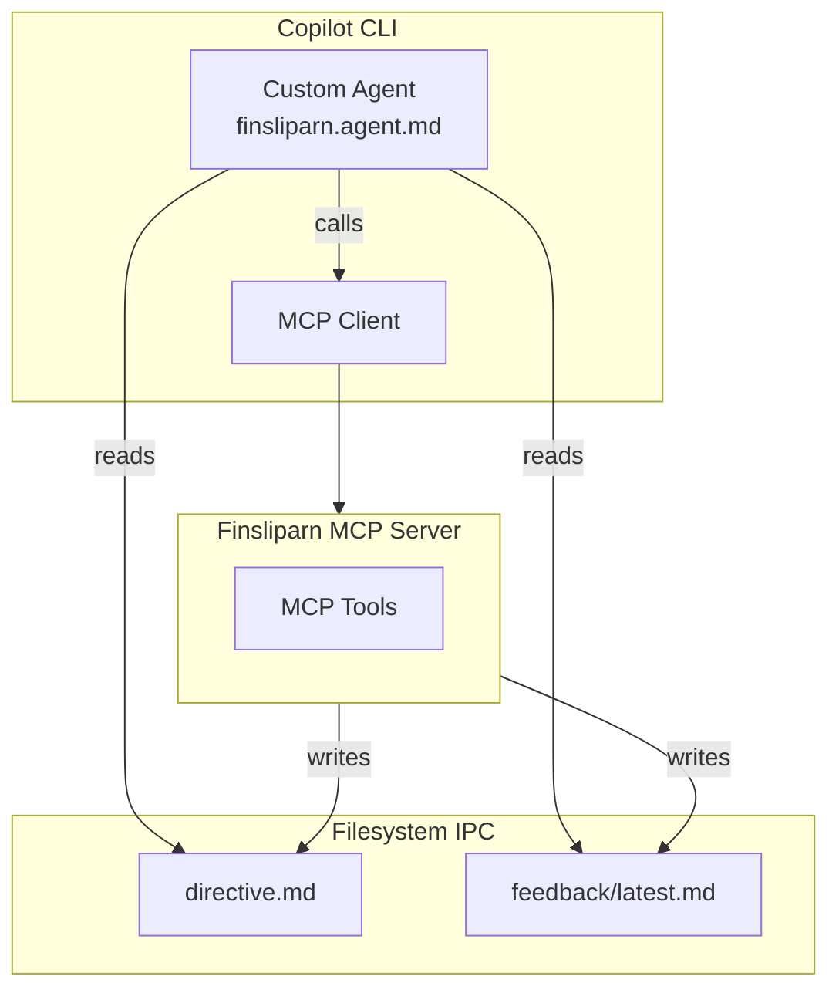
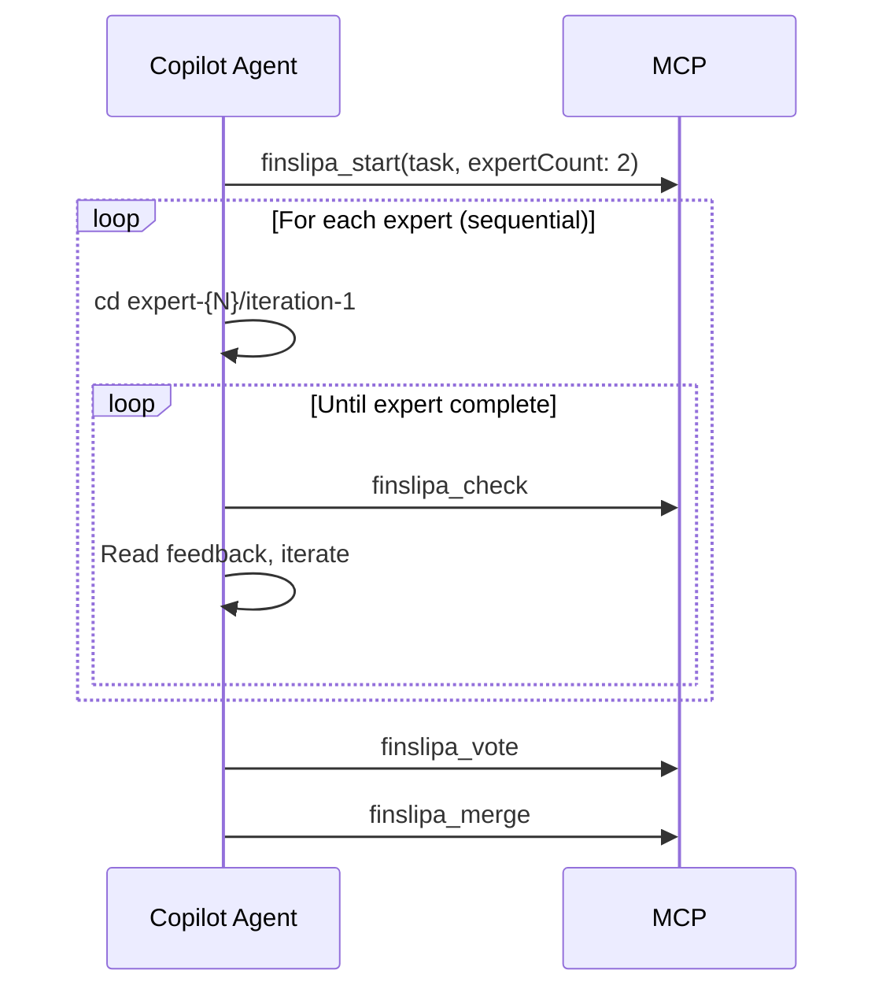

# Finsliparn: GitHub Copilot CLI Addendum

- **Version**: 2.0.0
- **Status**: Specification
- **Prerequisite**: `spec-cc.md` (authoritative reference)

---

## Overview

This document specifies Copilot CLI-specific adaptations. For core architecture, tools, and algorithms, see `spec-cc.md`.

**Key difference**: Copilot CLI lacks hooks (PreToolUse/PostToolUse) and custom slash commands. Instead, a custom agent polls `directive.md` and follows its instructions.

---

## 1. Feature Mapping

| Feature | Claude Code | Copilot CLI |
|---------|-------------|-------------|
| Session kickoff | `/finslipa` slash command | `--agent=finsliparn` |
| Feedback injection | `PostToolUse` hook | Filesystem polling via agent |
| Progress tracking | Hook-injected messages | `directive.md` file |
| MCP tools | Plugin manifest | `~/.copilot/mcp-config.json` |
| Iteration trigger | Automatic via hook | Agent calls `finslipa_check` |
| Multi-expert | Parallel Task agents (parent orchestration) | Sequential (single context) |
| MCP access in multi-expert | Parent only (subagents lack MCP) | Direct (agent has MCP) |

---

## 2. Architecture



For directory structure, see `spec-cc.md` Section 3.2.

---

## 3. Custom Agent Definition

**Location**: `.github/agents/finsliparn.agent.md`

```markdown
---
name: finsliparn
description: Iterative code refinement with test-driven validation
tools:
  - "finsliparn/*"
  - "shell"
  - "write"
  - "read"
---

# Finsliparn: Iterative Code Refinement Agent

You are a code refinement specialist. Implement solutions that pass all tests through iterative improvement.

## Core Loop

**CRITICAL**: After EVERY action:
1. Read `.finsliparn/directive.md`
2. Follow its instructions EXACTLY
3. Continue until STATUS: COMPLETE

## Starting a Session

1. Call `finslipa_start` with task description
2. Read `.finsliparn/directive.md`
3. Implement solution

## During Implementation

1. Make changes to target files
2. Call `finslipa_check` after EVERY change
3. If tests fail, read `feedback/latest.md`
4. Address feedback and repeat

## Validation Rules

- NEVER skip reading feedback after failed check
- NEVER call `finslipa_merge` unless directive shows 100%
- If stuck 3+ iterations on same error, ask user

## Tool Reference

| Tool | When to Call |
|------|--------------|
| `finslipa_start` | User provides new task |
| `finslipa_check` | After EVERY code change |
| `finslipa_vote` | Directive status = VOTING |
| `finslipa_merge` | Directive status = COMPLETE |
| `finslipa_status` | Check state without running tests |
| `finslipa_cancel` | Abort and cleanup |

## Parallel Expert Mode

When `finslipa_start` returns multiple worktrees:
1. Read `race.md` for expert list
2. For each incomplete expert:
   - `cd` to expert's worktree
   - Read `directives/expert-{N}.md`
   - Iterate until converged
3. Call `finslipa_vote` when all complete
4. Call `finslipa_merge`

**CRITICAL**: Each expert works in its OWN worktree. Do NOT mix changes.
```

### 3.1 Organization-Level Agent

For org-wide deployment, bundle MCP server config:

**Location**: `{org}/.github-private/agents/finsliparn.agent.md`

```markdown
---
name: finsliparn
description: Iterative code refinement
tools: ["finsliparn/*", "shell", "write", "read"]
mcp-servers:
  finsliparn:
    type: local
    command: bunx
    args: ["finsliparn-mcp"]
    env:
      FINSLIPARN_HOME: "${workspaceFolder}/.finsliparn"
---
[... agent instructions ...]
```

---

## 4. MCP Configuration

### User-Level (`~/.copilot/mcp-config.json`)

```json
{
  "mcpServers": {
    "finsliparn": {
      "command": "bunx",
      "args": ["finsliparn-mcp"]
    }
  }
}
```

### Repository-Level

Configure via GitHub repository settings UI/API. Agent references tools from configured servers.

---

## 5. Workflow Example

```
$ copilot --agent=finsliparn

User: Implement a rate limiter with sliding window

Agent: [finslipa_start] → [read directive.md] → [implement]
       [finslipa_check] → 40% (2/5 tests)
       [read feedback] → fix window calculation
       [finslipa_check] → 80% (4/5 tests)
       [read feedback] → fix concurrency
       [finslipa_check] → 100% ✅
       [finslipa_merge] → Done! 3 iterations.
```

---

## 6. Limitations & Mitigations

### Tool Approval Friction

```bash
copilot --agent=finsliparn \
        --allow-tool 'finsliparn/*' \
        --allow-tool 'shell(bun test:*)' \
        --allow-tool 'write'
```

### Agent Instruction Compliance

1. Agent instructions use explicit "CRITICAL" and "MUST" language
2. `finslipa_check` returns next steps in response AND updates directive
3. Directive includes timestamps for stale state detection

### No Hook Guarantees

1. Agent instructions emphasize calling `finslipa_check` after EVERY change
2. `finslipa_check` is idempotent (safe to call multiple times)

---

## 7. Parallel Experts: Copilot Differences

See `spec-cc.md` Section 13 for authoritative parallel experts architecture.

**Copilot-specific**: Sequential execution with direct MCP access

| Aspect | Claude Code | Copilot CLI |
|--------|-------------|-------------|
| Execution | Parallel Task agents | Sequential in single context |
| Orchestration | Parent orchestration required | Agent calls MCP directly |
| MCP access | Subagents lack MCP | Agent has full MCP access |
| `finslipa_check` | Parent calls with `worktreePath` | Agent calls directly from worktree |
| Progress | Parent tracks completion | Agent polls `race.md` |

**Why no parent orchestration for Copilot?** The Copilot agent runs in a single context with direct MCP server access via `~/.copilot/mcp-config.json`. Unlike Claude Code's Task subagents (which cannot inherit MCP connections), the Copilot agent can call `finslipa_check` directly from each expert's worktree.



**Limitations**:

- Sequential execution slower than parallel
- Single context has memory constraints
- Cannot truly race experts (focus on seed diversity instead)

---

## 8. Implementation Checklist

- [ ] Create `finsliparn.agent.md` with instructions
- [ ] Test basic single-expert flow
- [ ] Add `--allow-tool` documentation
- [ ] Test multi-expert sequential flow
- [ ] Publish `bunx finsliparn-mcp` package
