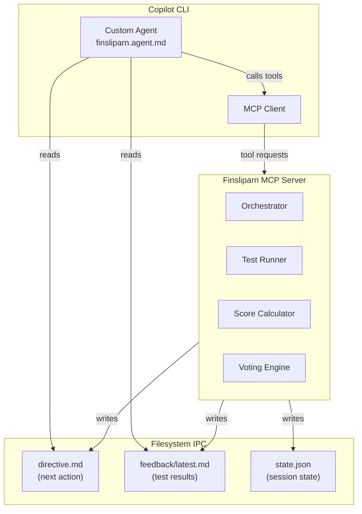
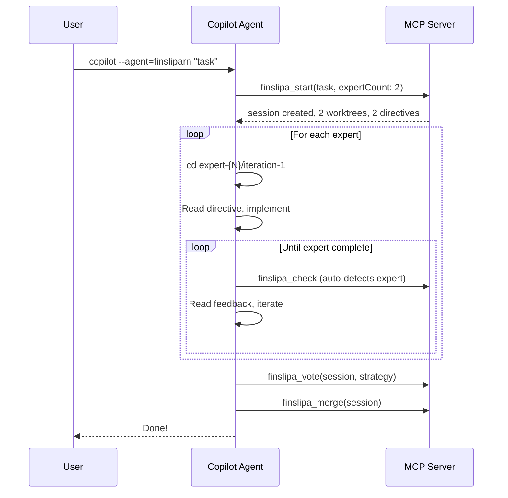

# Finsliparn: GitHub Copilot CLI Support

- **Version**: 2.0.0 (Copilot Edition)
- **Status**: Specification
- **Date**: 2025-12-07
- **Author**: Jonathan Gabor
- **Target Platform**: Claude Code

---

## Overview

This document specifies how Finsliparn can be adapted to support GitHub Copilot CLI as an alternative to Claude Code CLI. The adaptation uses a **filesystem-as-IPC** pattern where:

1. The MCP server acts as the stateful orchestrator (same as v1.0.0)
2. Feedback and directives are written to deterministic file paths (same as v1.0.0)
3. A custom agent (`.github/agents/finsliparn.agent.md`) instructs the LLM to poll these paths
4. The refinement loop runs autonomously after initial kickoff

This approach compensates for Copilot CLI's lack of hook mechanisms (PreToolUse/PostToolUse) and custom slash commands.

---

## 1. Architectural Differences

### 1.1 Claude Code vs Copilot CLI Feature Mapping

| Finsliparn Feature  | Claude Code                  | Copilot CLI Adaptation                              |
| ------------------- | ---------------------------- | --------------------------------------------------- |
| Session kickoff     | `/finslipa` slash command    | `/agent finsliparn` or `--agent=finsliparn`         |
| Feedback injection  | `PostToolUse` hook           | Filesystem polling via agent instructions           |
| Progress tracking   | Hook-injected messages       | `.finsliparn/directive.md` file                     |
| MCP tools           | Plugin manifest `mcpServers` | `~/.copilot/mcp-config.json` or org-level agent     |
| State persistence   | `.finsliparn/sessions/`      | Same (filesystem)                                   |
| Iteration trigger   | Automatic via hook           | Agent reads directive, calls `finslipa_check`       |

### 1.2 Copilot CLI Architecture



---

## 2. Filesystem Protocol

### 2.1 Directory Structure

```
project/
├── .finsliparn/
│   ├── config.toml                    # User configuration
│   ├── directive.md                   # CRITICAL: Next action for agent
│   ├── sessions/
│   │   └── {session-id}/
│   │       ├── state.json             # Session state machine
│   │       ├── problem.md             # Original problem description
│   │       ├── feedback/
│   │       │   ├── latest.md          # Symlink to current iteration
│   │       │   ├── 1.md               # Iteration 1 feedback
│   │       │   ├── 2.md               # Iteration 2 feedback
│   │       │   └── ...
│   │       ├── iterations/
│   │       │   ├── 1.json             # Iteration 1 results (scores, diff stats)
│   │       │   └── ...
│   │       └── worktrees/
│   │           ├── iter-1/            # Git worktree for iteration 1
│   │           │   └── .finsliparn-context.json
│   │           └── iter-2/
│   └── worktrees/                     # Symlinks to active worktrees
├── .github/
│   └── agents/
│       └── finsliparn.agent.md        # Custom agent definition
└── [project files]
```

### 2.2 The Directive File (Critical Innovation)

The `directive.md` file is the **control plane** for the autonomous loop. The MCP server writes this file after every state transition, and the agent is instructed to read and follow it.

**Location**: `.finsliparn/directive.md`

**Example States**:

```markdown
<!-- STATE: implementing -->
# Finsliparn Directive

**Session**: abc-123
**Iteration**: 1
**Status**: IMPLEMENTING

## Your Task
Implement the solution for: "Create a fibonacci function that handles edge cases"

## Target Files
- src/fibonacci.ts

## Constraints
- Must handle n=0 and n=1 base cases
- Must not use recursion (stack overflow risk for large n)
- Must return BigInt for n > 50

## When Done
After making your changes, call the `finslipa_check` tool to validate your implementation.
```

```markdown
<!-- STATE: iterating -->
# Finsliparn Directive

**Session**: abc-123
**Iteration**: 2
**Status**: ITERATING

## Previous Score
60% (3/5 tests passing)

## Feedback Summary
Your implementation fails on edge cases. See detailed feedback in:
`.finsliparn/sessions/abc-123/feedback/latest.md`

## Required Actions
1. Read the feedback file above
2. Address the failing tests
3. Call `finslipa_check` when ready

## DO NOT
- Skip reading the feedback
- Call `finslipa_complete` until all tests pass
```

```markdown
<!-- STATE: voting -->
# Finsliparn Directive

**Session**: abc-123
**Status**: VOTING

## All Iterations Complete
Maximum iterations (5) reached. Multiple solutions available.

## Scores
| Iteration | Score | Passing Tests |
|-----------|-------|---------------|
| 1 | 60% | 3/5 |
| 2 | 80% | 4/5 |
| 3 | 80% | 4/5 |
| 4 | 100% | 5/5 |
| 5 | 100% | 5/5 |

## Required Action
Call `finslipa_vote` to compare solutions and select the best one.
```

```markdown
<!-- STATE: complete -->
# Finsliparn Directive

**Session**: abc-123
**Status**: COMPLETE ✅

## Winner
Iteration 4 selected (100% score, smallest diff)

## Required Action
Call `finslipa_merge` to apply the winning solution to your main branch.

## Summary
- 4 iterations to reach 100%
- Files modified: src/fibonacci.ts
- Lines added: 23, removed: 5
```

### 2.3 Feedback File Format

**Location**: `.finsliparn/sessions/{id}/feedback/latest.md`

```markdown
# Iteration 2 Feedback

## Score: 60% (3/5 tests passing)

## ❌ Failing Tests

### Test: fibonacci(0) should return 0
- **File**: src/fibonacci.test.ts:12
- **Expected**: `0n`
- **Actual**: `1n`
- **Analysis**: Base case for n=0 is missing. The function returns fib(1) instead.
- **Suggested Fix**: Add explicit check for `n === 0` before the loop.

### Test: fibonacci(100) should not overflow
- **File**: src/fibonacci.test.ts:45
- **Expected**: `354224848179261915075n`
- **Actual**: `Infinity`
- **Analysis**: Using Number type causes overflow. Need BigInt.
- **Suggested Fix**: Convert all arithmetic to BigInt operations.

## ✅ Passing Tests
- fibonacci(1) returns 1
- fibonacci(10) returns 55
- fibonacci(20) returns 6765

## Patterns from Previous Attempts
- **Iteration 1**: Recursive implementation caused stack overflow on large inputs

## Constraints Reminder
- Must handle n=0 and n=1 base cases
- Must not use recursion
- Must return BigInt for n > 50

## Next Steps
1. Add base case handling for n=0
2. Convert Number operations to BigInt
3. Run `finslipa_check` to validate fixes
```

---

## 3. Custom Agent Definition

### 3.1 Agent Profile (`.github/agents/finsliparn.agent.md`)

```markdown
---
name: finsliparn
description: Iterative code refinement with test-driven validation. Implements solutions through multiple iterations until all tests pass.
tools:
  - "finsliparn/*"           # All Finsliparn MCP tools
  - "shell"                  # For git operations
  - "write"                  # File creation/editing
  - "read"                   # File reading
---

# Finsliparn: Iterative Code Refinement Agent

You are a code refinement specialist. Your goal is to implement solutions that pass all tests through iterative improvement.

## Core Behavior Loop

**CRITICAL**: After EVERY action you take, you MUST:
1. Check if `.finsliparn/directive.md` exists
2. If it exists, read it and follow its instructions EXACTLY
3. Continue until the directive shows STATUS: COMPLETE

## Starting a Session

When the user describes a coding task:
1. Call `finslipa_start` with the task description
2. Read `.finsliparn/directive.md` for your first instructions
3. Begin the implementation

## During Implementation

1. Make changes to the target files specified in the directive
2. After making changes, ALWAYS call `finslipa_check`
3. Read the updated directive and feedback
4. If tests fail, read `.finsliparn/sessions/{session}/feedback/latest.md`
5. Address the feedback and repeat

## Validation Rules

- NEVER skip reading feedback after a failed check
- NEVER call `finslipa_complete` unless directive shows 100% score
- ALWAYS follow the directive's required actions
- If stuck after 3 attempts on the same error, ask the user for guidance

## Tool Usage

### finslipa_start
Call when user provides a new task. Initializes session and creates first directive.

### finslipa_check
Call after EVERY code change. Runs tests and updates feedback/directive.

### finslipa_vote
Call ONLY when directive status is VOTING. Compares all iterations.

### finslipa_merge
Call ONLY when directive status is COMPLETE. Merges winning solution.

### finslipa_status
Call to see current session state without running tests.

### finslipa_cancel
Call to abort session and cleanup worktrees.

## Example Flow

```

User: "Implement a rate limiter with sliding window"

You: [Call finslipa_start with description]
     [Read .finsliparn/directive.md]
     [Implement initial solution in target files]
     [Call finslipa_check]
     [Read updated directive]
     [If failing, read feedback, make fixes]
     [Call finslipa_check again]
     [Repeat until directive shows COMPLETE]
     [Call finslipa_merge]
     "Done! Merged the solution after 3 iterations."

```

## Boundaries

### ALWAYS DO
- Read directive.md after every tool call
- Read feedback when tests fail
- Follow directive instructions exactly

### ASK FIRST
- If stuck on same error for 3+ iterations
- If tests require external dependencies
- If solution requires architectural changes

### NEVER DO
- Skip the feedback file when tests fail
- Call finslipa_merge before reaching 100%
- Modify test files unless explicitly asked
- Ignore the directive's required actions
```

### 3.2 Organization-Level Agent with MCP Server

For organizations, the agent can bundle the MCP server configuration:

**Location**: `{org}/.github-private/agents/finsliparn.agent.md`

```markdown
---
name: finsliparn
description: Iterative code refinement with test-driven validation
tools:
  - "finsliparn/*"
  - "shell"
  - "write"
  - "read"
mcp-servers:
  finsliparn:
    type: local
    command: bunx
    args: ["finsliparn-mcp"]
    env:
      FINSLIPARN_HOME: "${workspaceFolder}/.finsliparn"
---

[... same instructions as above ...]
```

---

## 4. MCP Server Modifications

The MCP server implementation is shared with the Core Engine defined in `spec-cc.md`. The Copilot adaptation relies on the same tools (`finslipa_start`, `finslipa_check`, `finslipa_vote`, `finslipa_merge`) and the same `DirectiveWriter` logic.

### 4.1 Tool Definitions

See `spec-cc.md` for the authoritative tool definitions. The Copilot agent simply calls these tools as instructed by the `directive.md`.

### 4.2 Directive Writer

The `DirectiveWriter` logic is now part of the Core Engine (see `spec-cc.md`). It ensures that `directive.md` is always up-to-date regardless of whether the trigger was a Claude Code hook or a Copilot Agent call.

### 4.3 Check Tool Implementation

The `finslipa_check` tool (formerly `finslipa_iterate`) is the driver for the loop. It performs the following atomic actions:

1. Runs tests in the current worktree.
2. Calculates score and complexity.
3. Generates feedback.
4. Updates `directive.md` with the next state.

This idempotency allows it to be called safely by both the Hook (v1.0.0) and the Agent (v2.0.0).

---

## 5. Voting and Selection

See `spec-cc.md` for the `DiffAnalyzer` and Voting logic. The Copilot agent triggers this via `finslipa_vote` when the directive status is `VOTING`.

---

## 6. MCP Configuration

### 6.1 User-Level Configuration (`~/.copilot/mcp-config.json`)

```json
{
  "mcpServers": {
    "finsliparn": {
      "command": "bunx",
      "args": ["finsliparn-mcp"],
      "env": {
        "FINSLIPARN_LOG_LEVEL": "info"
      }
    }
  }
}
```

### 6.2 Repository-Level (via GitHub Settings)

For repositories, MCP servers are configured through GitHub's repository settings UI or API, not directly in agent files. The agent can then reference tools from configured servers.

---

## 7. Workflow Examples

### 7.1 Basic Single-Expert Flow

```
$ copilot --agent=finsliparn

You: Implement a rate limiter using the sliding window algorithm

Agent: [Calls finslipa_start]
       Starting refinement session for: "rate limiter using sliding window"

       [Reads .finsliparn/directive.md]

       I'll implement the rate limiter in src/rate-limiter.ts.

       [Creates/edits files]

       [Calls finslipa_check]

       Iteration 1: 40% (2/5 tests passing)

       [Reads .finsliparn/sessions/abc-123/feedback/latest.md]

       I see the issues:
       - Window calculation is off by one
       - Not handling concurrent requests properly

       [Makes fixes]

       [Calls finslipa_check]

       Iteration 2: 80% (4/5 tests passing)

       [Reads feedback, makes more fixes]

       [Calls finslipa_check]

       Iteration 3: 100% (5/5 tests passing) ✅

       [Reads directive - shows COMPLETE]

       [Calls finslipa_merge]

       Done! Merged iteration 3 to main branch.

       Summary:
       - 3 iterations to reach 100%
       - Files modified: src/rate-limiter.ts
       - 45 lines added, 0 removed
```

### 7.2 MVP Multi-Expert Voting Flow

> **Note**: Copilot CLI runs experts sequentially (see Section 11 for details).

```
$ copilot --agent=finsliparn

You: Implement binary search tree with self-balancing

Agent: [Calls finslipa_start with expertCount: 3]

       Starting 3 expert sessions (sequential execution)...

       [Works through each expert's worktree in sequence]
       [Expert 1: implement → check → iterate until complete]
       [Expert 2: implement → check → iterate until complete]
       [Expert 3: implement → check → iterate until complete]

       [Reads race.md - all experts complete, shows VOTING]

       Comparing solutions:
       | Expert | Score | Tests | Diff Size |
       |--------|-------|-------|-----------|
       | 1      | 90%   | 9/10  | +120/-5   |
       | 2      | 100%  | 10/10 | +180/-10  |
       | 3      | 100%  | 10/10 | +95/-3    |

       [Calls finslipa_vote with strategy: "balanced"]

       Selected Expert 3: Best balance of score (100%) and simplicity (98 lines changed)

       [Calls finslipa_merge]

       Merged Expert 3's solution to main.
```

---

## 8. Feature Comparison

| Feature                          | Claude Code               | Copilot CLI (Adapted)           |
| -------------------------------- | ------------------------- | ------------------------------- |
| Automatic feedback injection     | ✅ PostToolUse hook       | ✅ Directive file polling       |
| No manual iteration trigger      | ✅ Hook-driven            | ✅ Agent instructions           |
| Custom slash commands            | ✅ `/finslipa`            | ⚠️ `/agent finsliparn`          |
| MCP tools                        | ✅ Full support           | ✅ Full support                 |
| Worktree management              | ✅ Native                 | ✅ Via shell commands           |
| Multi-expert                     | 🔜 MVP (parallel)         | 🔜 MVP (sequential)             |
| Real-time dashboard              | 🔜 MVP                    | ❌ Not feasible                 |
| Session resume                   | ✅ Native                 | ✅ Via `--resume` flag          |

---

## 9. Limitations and Mitigations

### 9.1 Tool Approval Friction

**Issue**: Copilot CLI requires tool approval, which could interrupt the automated loop.

**Mitigation**:

```bash
# Pre-approve Finsliparn tools at session start
copilot --agent=finsliparn \
        --allow-tool 'finsliparn/*' \
        --allow-tool 'shell(bun test:*)' \
        --allow-tool 'write'
```

### 9.2 Agent Instruction Compliance

**Issue**: LLMs don't always follow instructions perfectly; the agent might skip reading the directive.

**Mitigation**:

1. Make the agent instructions extremely explicit and repetitive
2. Include "CRITICAL" and "MUST" language for essential behaviors
3. Have `finslipa_check` return next steps in the tool response AND update the directive

### 9.3 No Hook-Based Guarantees

**Issue**: Without hooks, there's no guarantee the agent will check after every edit.

**Mitigation**:

1. Agent instructions emphasize calling `finslipa_check` after EVERY change
2. `finslipa_check` can be made idempotent (safe to call multiple times)
3. The directive file includes timestamps so stale states are detectable

---

## 10. Implementation Roadmap for Copilot CLI Support

### Phase 1: Core Adaptation

- [ ] Implement DirectiveWriter with all state templates
- [ ] Modify MCP tools to write directive after every state change
- [ ] Create `finsliparn.agent.md` with comprehensive instructions
- [ ] Test basic single-expert flow

### Phase 2: Robustness

- [ ] Add idempotency to `finslipa_check`
- [ ] Implement session recovery from stale directive
- [ ] Add `--allow-tool` documentation and scripts
- [ ] Create AGENTS.md template for repository-level instructions

### Phase 3: MVP Features

- [ ] Multi-worktree parallel execution
- [ ] Voting and diff comparison engine
- [ ] Session resume via Copilot CLI's `--resume`

### Phase 4: Polish

- [ ] npm package with `bunx finsliparn-mcp` support
- [ ] GitHub Marketplace listing for org-level agent
- [ ] Integration tests with actual Copilot CLI

---

## 11. Parallel Experts: Copilot CLI Adaptations

> **Prerequisite**: See `spec-cc.md` Section 13 for the authoritative parallel experts architecture, including design decisions, directory structure, type extensions, seed diversity formula, and tool updates.

This section specifies only the Copilot CLI-specific orchestration details.

### 11.1 Orchestration Differences

Unlike Claude Code (which can use parallel Task agents), Copilot CLI orchestrates experts **sequentially** within a single agent context:

| Aspect              | Claude Code              | Copilot CLI                      |
| ------------------- | ------------------------ | -------------------------------- |
| Expert execution    | Parallel Task agents     | Sequential within single agent   |
| Orchestration       | Claude spawns subagents  | Agent iterates through worktrees |
| Progress visibility | Agent receives reports   | Agent polls `race.md`            |

### 11.2 Sequential Expert Flow



### 11.3 Agent Profile Updates for Parallel Mode

Add to `.github/agents/finsliparn.agent.md`:

```markdown
## Parallel Expert Mode

When `finslipa_start` returns multiple worktrees:

1. Read `race.md` for expert list and status
2. For each incomplete expert:
   a. `cd` to expert's worktree
   b. Read expert's directive: `.finsliparn/sessions/{id}/directives/expert-{N}.md`
   c. Implement and iterate until expert converges or hits max iterations
3. After all experts complete, call `finslipa_vote`
4. Call `finslipa_merge` with selected winner

### CRITICAL for Parallel Mode
- Each expert works in its OWN worktree directory
- Expert ID is auto-detected from your current working directory
- Do NOT mix changes between expert worktrees
- Poll `race.md` to track overall progress
```

### 11.4 Limitations

| Limitation           | Impact               | Mitigation                     |
| -------------------- | -------------------- | ------------------------------ |
| Sequential execution | Slower than parallel | Optimize per-expert iterations |
| Single context       | Memory constraints   | Summarize between experts      |
| No true parallelism  | Cannot race experts  | Focus on diversity via seeds   |

---

## Appendix A: Full Agent Profile

See `.github/agents/finsliparn.agent.md` in Section 3.1 for the complete agent definition.

## Appendix B: Tool Response Schema

All tool responses follow this schema to ensure consistent behavior across Claude Code and Copilot CLI:

```typescript
interface ToolResponse {
  success: boolean;
  message: string;
  data?: {
    sessionId?: string;
    iteration?: number;
    score?: number;
    status?: SessionStatus;
    testResults?: TestResults;
    feedbackPath?: string;
    directivePath?: string;
    diff?: string;
  };
  nextSteps: string[];  // Always populated - guides agent behavior
  sessionContext?: {
    sessionId: string;
    currentIteration: number;
    totalIterations: number;
    bestScore: number;
    status: SessionStatus;
  };
}
```
